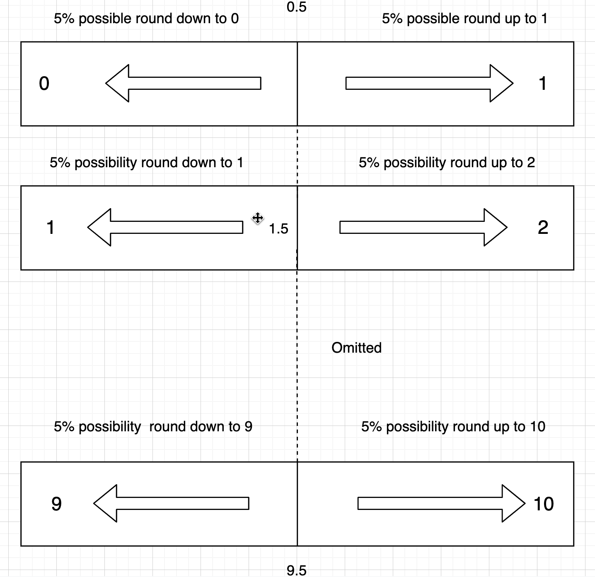

## An interesting question: Is the average of the sum of five random integers between 1-10 really 27.5？


## Hypothesis

if we take a random number between 1 and 10 five times while rounding this random number to a integer, after that the range of total must be between 5 to 50.

After that, the average of this total should be closed to (50+5)/2 = 27.5.

The above assumption is very simple and does not show any flaws, but is it really the case?

## Verification

So, i wrote a script to confirm my hypothesis,

1. Create a function(sumRandsTest01) which can return a average of total.
2. At the same time check average of 5 times round(rand())
   （I suspected that the problem might be the value deviation of the function rand of matlab）
3. This function will be automatically run 10000000 times (relatively big enough to avoid random errors)
4. Finally, the average of 10000000 times test results will be displayed on the console.

The measured results are **not** around **27.5**. It is between **26.2-26.4**. 

```matlab
clc;
clear;

overAllTotal = 0;
overRTotal = 0;
testTimes = 10000000;
for i = 1:testTimes
    [Num1,Num2] = sumRandsTest01();
    overAllTotal = overAllTotal + Num1;
    overRTotal = overRTotal + Num2;
    % disp(number);
end
disp(overAllTotal / testTimes);
disp(overRTotal / testTimes);


% rTotal refer round(rand())；
function [total,rTotal] = sumRandsTest01()
        total = 0;
        rTotal = 0;
    for i = 1:5
        % The code below range in 0 - 10;
        number =  round(rand()*10);
        
        % use a conditional to limit number into required range (1-10);
        while number < 1
            number =  round(rand()*10);
        end

        % test the conditional above working properly.
        if number < 1
            error('number < 1');
        end

        % debug property;
        % disp(number);

        total = total + number;

        rTotal = rTotal + round(rand());
    end
end


```

## Analysis 



After consideration, I found that this problem should be refered to the rounded part.

1. From the above figure, there may be 5% possibility to get a random number which less then 0.5.
   In other words, After round function has been progressed, the probability that the obtained Integer is 0 is 5%  

2. Similarly, there may be 5% possibility to get a random number which greater then 9.5.

   In other words, After round function has been progressed, the probability that the obtained Integer is 10 is 5% 

From the analysis above, the probability of getting 1-9 is the as same as close to 10%, but the probability of getting 10 is only close to 5%.

## Where did the remaining 5% go?


Focus on the first part when the integer obtained by rounding are 1, the program will not do other operations. 

But if the integer is 0, in order to meet the requirements, the program will re-calculate the value according to the pre-designed judgment. Here is where the 5% is going.

```matlab
while number < 1
    number =  round(rand()*10);
end
```
The above code is implemented. If number is less than 1, then the number will be reselected until the number is greater than 1. So, how many times this code will run will not be expected and we can only try to calculate the emergence of such small possibilities.

Here I make the assumption that the program will choose 10 consecutive times less than 0.5.

Needless to say, this chance be less than one million dollars in the lottery

1. The probability of getting less than 0.5 for the first time is 5%
2. Second time is 5% * 5%
3. Third time is 5% * 5% * 5% .....
4. Tenth time is (5%)^10

This possibility is calculated by the following calculation: **0.0526**

```matlab
clc;
clear;

number = 0.05;
count = 0;
for i = 1:10
    count = count + power(number, i);
    % disp(power(number, i))
end

per = 1 - count;
disp(per);

disp( (50 * per + 5 * (1 + count)) / 2 );

```

This possibility ultimately leads to the offset of the boundary  (maximum and minimum) . So i use this possibility to change the range and recalculate the average to get a closer result: **26.3158**

This also proves that my previous conjecture lacked some considerations. After recalculating the probability, we got an average value closer to the real value (the result of 10,000,000 runs).