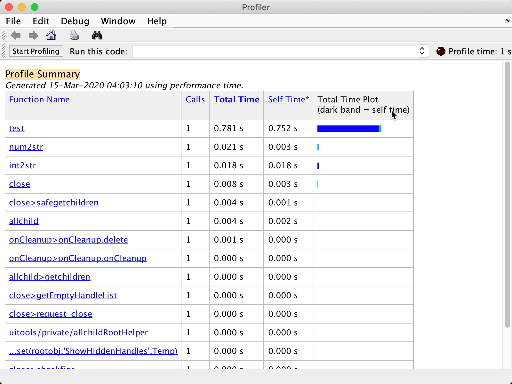
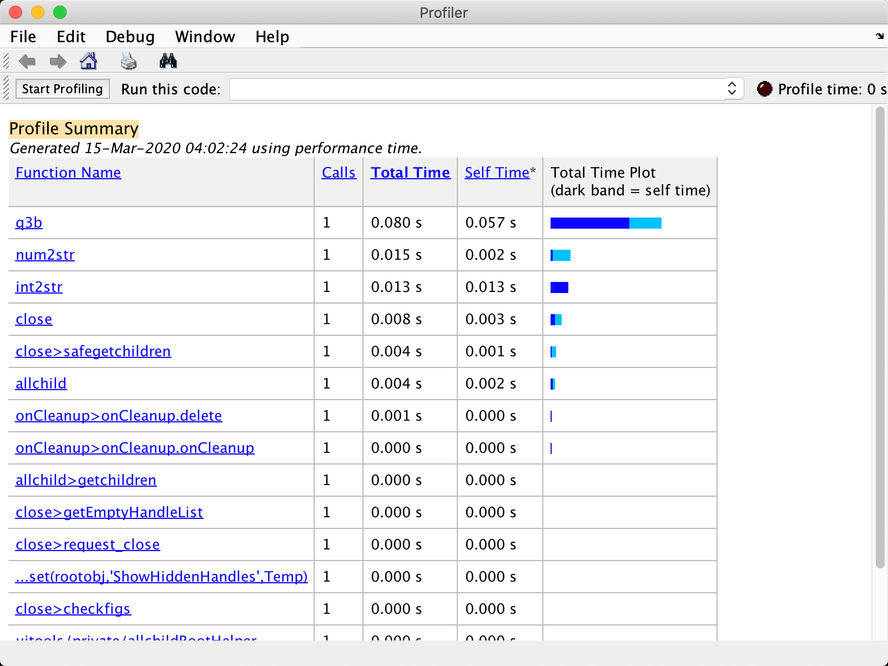

## Why we need to preallocate the Size of Vector?

### 1. An example with NOT preallocated sized Vector.

```matlab
clc;
clear;
close all;

% define years
years=[2015:222410];

% define leapYears
leapYears = [];

for i = 1:length(years)
    if mod(years(i),4) == 0
        leapYears = [leapYears , years(i)];
    end
end

disp(num2str(leapYears));
```

**After save this program into file and run it, the warning info will be displayed**

The variable 'leapYears' appears to change size on every loop iteration (within a script). Consider preallocating for speed.




### 2. Rewirte with preallocated sized vector 

The code below may take more operation to preallocate Vector, is this performance reducing ?

```matlab
clc;
clear;
close all;

% define years
% years=[2015:2041];
years=[2015:222410];

% preallocate huge size empty vector, the size is 22241 - 2015
leapYears = int16.empty(length(years),0);

% define a index which only change when confidential works
lastIndex = 0;
for i = 1:length(years)
    % check the single element can be divided by 4 or not
    if mod(years(i),4) == 0
        % if current element can be divided by, append it into leapYears vector.
        leapYears(lastIndex + 1) = years(i);
        % only increase index when confidential works
        lastIndex = lastIndex + 1;
    end
end

% remove all empty elements.
leapYears = leapYears(leapYears ~= 0);

% display output 
disp(num2str(leapYears));

```




### Notice : 

**This script is partly based on practical question, but the size of vector which used for this test has been increased to huge enough to compare performance difference.** 

### Conclusion: 

**Dynamic extend vector's size in loop is an operation which spend huge almost of resource and DO reduce performance specify when loop runs lots of travels.**

> ref : https://au.mathworks.com/matlabcentral/answers/431750-how-to-pre-allocate-for-unknown-size-vector